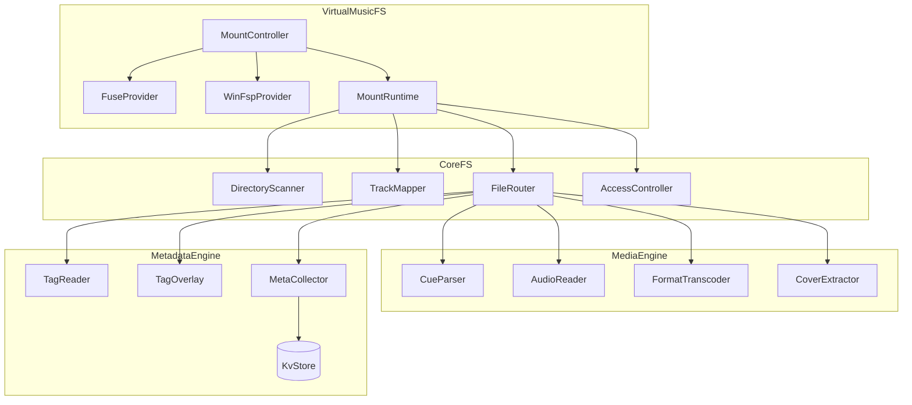
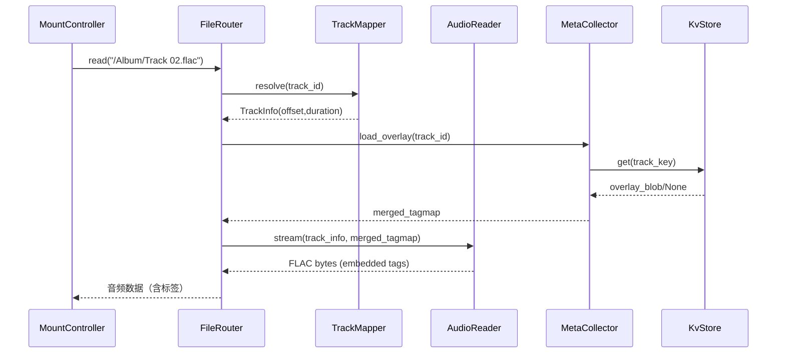
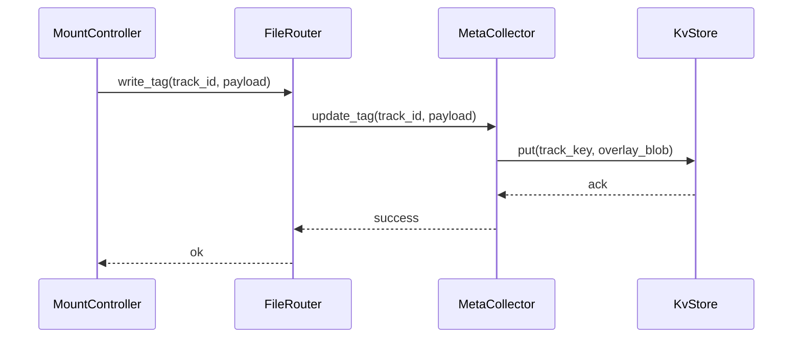

# MusFuse 架构策划案

> 面向跨平台的虚拟音乐文件系统（Linux/macOS FUSE + Windows WinFSP），聚焦分轨虚拟化、音频策略、元数据覆盖与可插拔 KV 存储层。

---

## 目录

1. [目标与范围](#目标与范围)
2. [系统背景与约束](#系统背景与约束)
3. [整体架构俯瞰](#整体架构俯瞰)
4. [核心分层设计](#核心分层设计)
5. [关键模块详解](#关键模块详解)
6. [数据流 ✉️](#数据流-️)
7. [可插拔 KV 存储层](#可插拔-kv-存储层)
8. [音频策略与媒体管线](#音频策略与媒体管线)
9. [跨平台挂载策略](#跨平台挂载策略)
10. [接口与 Trait 草图](#接口与-trait-草图)
11. [性能与可扩展性](#性能与可扩展性)
12. [测试、监控与可观测性](#测试监控与可观测性)
13. [开发里程碑建议](#开发里程碑建议)
14. [未来扩展方向](#未来扩展方向)

---

## 目标与范围

- **核心目标**
  - 将真实音频资产（含 cue + 音源 + 封面）虚拟化为跨平台的文件系统视图。
  - 对 cue 分轨进行“虚拟展开”，并在虚拟层实现元数据覆盖而非原文件写入。
  - 所有 Tag/元数据统一抽象，由外部 KV 层持久化与缓存。
  - 提供统一的音频格式策略（有损原样、无损转码为 FLAC）与封面提取。
  - 对外仅暴露音频/封面等虚拟文件，标签内容随音频容器内嵌或通过挂载接口读写。
- **非目标**
  - 不在第一阶段处理分布式集群挂载、用户权限隔离、多租户等高级特性。
  - 不负责深度的在线流媒体分发（可后续通过 REST/gRPC 暴露）。

---

## 系统背景与约束

- 运行环境：Rust 1.80+，跨平台（Linux/macOS/Windows）。
- 文件系统依赖：`fuse3` (Linux/macOS)、`winfsp` + `fuse-backend-rs` (Windows)。
- 音频解析：`symphonia`、`lofty`、`libflac-sys` 或 `ffmpeg` 绑定。
- 存储层：默认内置 `sled`，可选 `RocksDB`、`SQLite` (kv)、`Redis`。
- 封面与元数据操作需要高吞吐但低延迟，需考虑缓存和懒加载策略。

---

## 整体架构俯瞰



> 注：写入操作只更新 KV 中的覆盖数据，源音频不会被直接改写，下一次读取时由媒体引擎负责把最新标签同步进音频容器。

---

## 核心分层设计

| 层级 | 主要职责 | 输入 | 输出 |
| ---- | -------- | ---- | ---- |
| VirtualMusicFS | 统一挂载入口，调度平台特定 provider，管理生命周期与健康状况 | CLI 配置、系统钩子 | 虚拟文件系统 mount 点 |
| Core Filesystem Layer | 解析路径 → 轨道/文件映射，提供读写路由与权限控制 | 虚拟路径请求 | 文件元数据、读写流 | 
| Media Engine | 解析 cue、读取音频帧、转码、抽取封面 | 真实文件句柄、偏移 | PCM/FLAC 数据流、封面 blob |
| Metadata Engine | 读取/覆盖 tag，集中缓存与持久化 | TrackId、元数据命令 | Tag overlay、封面引用、写入确认 |

---

## 关键模块详解

| 模块 | 职责 | 要点 |
| ---- | ---- | ---- |
| `MountController` | 根据配置初始化 Provider，并暴露统一 API (`mount()`, `unmount()`, `status()`) | 支持 CLI/守护进程模式，处理信号与心跳检查 |
| `FuseProvider` | Linux/macOS 下实现 `fuse3::Filesystem` trait | 封装平台差异，统一转发到 `CoreFS` |
| `WinFspProvider` | Windows 下使用 WinFSP SDK 或 `fuse-backend-rs` | 封装 Windows 特有的路径/权限处理 |
| `DirectoryScanner` | 扫描真实目录，生成目录缓存，监听文件变动 | 支持 lazy scan 与主动刷新，结合 `notify` crate |
| `TrackMapper` | cue → Track 实体映射，维护轨道索引 | Track 包含 `TrackId`, `offset`, `duration` 等元信息 |
| `FileRouter` | 根据虚拟路径确定读取策略（原样/分轨/封面） | 对接权限策略、缓存策略 |
| `CueParser` | 使用 `cue-parser` 或自研解析器提取分轨信息 | 结果持久化于 KV，提供 hash 校验 |
| `AudioReader` | 统一音频读取接口，封装 `symphonia` | 提供 seek/read frame、支持多格式 |
| `FormatTranscoder` | 将无损格式规范化输出为 FLAC | 支持实时流式转码，结合 ring buffer |
| `CoverExtractor` | 从文件系统或嵌入数据提取封面 | 可导出 `/Album/cover.jpg` 等虚拟路径 |
| `TagReader` | 读取原始文件 Tag | 结合 `lofty`，支持多格式 |
| `TagOverlay` | 合并 KV 层覆盖项与原始 Tag | 优先 KV，fallback 原始 |
| `MetaCollector` | 统一处理 Tag 查询与更新，对接 `KvStore` | 提供 `load_overlay`, `apply_delta` 等接口，供媒体流植入标签 |
| `KvStore` | 提供高性能 KV API，并具备过期策略 | 实现 `KvBackend` trait，可热插拔 |

---

## 数据流 ✉️

### 虚拟曲目读取



> 注：虚拟文件系统不会暴露独立的 JSON/文本元数据，`MetaCollector` 返回的 `TagMap` 会在媒体流阶段写入音频容器的标签区。

### Tag 写入



> 注：写入操作只会更新 KV 中的覆盖数据，源音频保持不变；后续读取时由媒体引擎把最新标签写回音频容器或外显接口。

---

## 可插拔 KV 存储层

### Trait 定义

```rust
pub trait KvBackend: Send + Sync + 'static {
    fn get(&self, key: &str) -> anyhow::Result<Option<Vec<u8>>>;
    fn put(&self, key: &str, value: &[u8]) -> anyhow::Result<()>;
    fn delete(&self, key: &str) -> anyhow::Result<()>;
    fn scan_prefix(&self, prefix: &str) -> anyhow::Result<Vec<(String, Vec<u8>)>>;
}
```

### 默认实现与特性对比

| 后端 | 特性 | 适用场景 | 依赖 |
| ---- | ---- | ---- | ---- |
| `sled` | 纯 Rust、部署简单、嵌入式 | 单机/桌面客户端 | 无外部依赖 |
| `RocksDB` | 高并发、定制压缩、写放大控制 | 音乐库量级高（>10w 曲目） | C++ 依赖，需打包 |
| `SQLite (KV)` | 易调试、支持 SQL 扩展、FTS | 需要复杂 Query / 工具接入 | `rusqlite` |
| `Redis` | 网络级、TTL、PubSub | 多机器共享缓存、远程管理 | 需要 Redis 服务 |

### 键空间规范

```
track:{album_hash}:{track_index}:tag      -> TagMap 覆盖数据（serde 序列化）
track:{album_hash}:{track_index}:cover    -> blob / 引用路径
album:{album_hash}:cover                  -> blob
album:{album_hash}:cue                    -> 解析后的结构体（二进制 bincode）
file:{abs_path_sha1}:stat                 -> serde 序列化（mtime, size, hash）
scan:last_run                             -> 时间戳
policy:{profile_name}                     -> 音频策略配置
```

### 序列化策略

- Tag/配置类：serde 序列化（默认 JSON，可按需切换 bincode 等）
- 大型二进制：直接存储 `Vec<u8>` 或外链路径（配置可选）
- Cue 解析缓存：`bincode` + 版本号，便于快速加载

---

## 音频策略与媒体管线

```rust
enum AudioFormatPolicy {
    PassthroughLossy,
    ConvertLossless,
}

fn policy_for_ext(ext: &str) -> AudioFormatPolicy {
    match ext.to_ascii_lowercase().as_str() {
        "mp3" | "aac" | "ogg" | "opus" => AudioFormatPolicy::PassthroughLossy,
        _ => AudioFormatPolicy::ConvertLossless,
    }
}
```

- **PassthroughLossy**：直接将原文件映射到虚拟路径，提供只读或受限写入。
- **ConvertLossless**：当访问 WAV/APE/WV/FLAC 时，实时转码为 FLAC 输出；可选启用缓存目录（`~/.musfuse/cache/flac/`）。
- 实现建议：构建基于 `async-stream` 的拉式流，配合 `tokio::io::AsyncRead`。

### 封面处理

- 探测顺序：内嵌封面 → 同目录 `cover.(jpg|png|jpeg|webp)` → `folder.*` → fallback。
- 缓存策略：封面哈希 → KV；虚拟路径 `/Album/cover.{ext}` 暴露。
- 支持多封面（front/back/disc）时，可暴露 `/Album/.meta/covers/front.jpg`。

---

## 跨平台挂载策略

| 平台 | Provider | 说明 |
| ---- | -------- | ---- |
| Linux/macOS | `FuseProvider` | 基于 `fuse3` crate，实现 `Filesystem` trait；支持自动重连与后台守护。
| Windows | `WinFspProvider` | 通过 WinFSP SDK 暴露 FUSE 兼容接口；需处理路径大小写与驱动签名问题。
| 容器/服务器 | `HttpProvider` (可选) | 以 HTTP/gRPC 模式暴露同样的读写 API，供远程挂载或 REST 查询（后续阶段）。

### MountController 职责

- 统一 CLI 配置解析（使用 `clap`）。
- 动态加载 Provider：
  - Linux/macOS 默认 FUSE。
  - Windows 自动检测 WinFSP 安装情况，否则报错。
- 提供健康检测与自动重挂载逻辑：
  - 监听系统信号（`SIGINT`, `SIGTERM`）。
  - 暴露 `health` API 供监控探针调用。

---

## 接口与 Trait 草图

```rust
pub struct MountConfig {
    pub source_dirs: Vec<PathBuf>,
    pub mount_point: PathBuf,
    pub kv_backend: KvBackendKind,
    pub policies: PolicyConfig,
    pub scan_mode: ScanMode,
}

pub trait MountProvider {
    fn mount(&self, config: Arc<AppContext>) -> anyhow::Result<()>;
    fn unmount(&self) -> anyhow::Result<()>;
    fn status(&self) -> MountStatus;
}

pub struct AppContext {
    pub kv: Arc<dyn KvBackend>,
    pub scanner: Arc<DirectoryScanner>,
    pub mapper: Arc<TrackMapper>,
    pub router: Arc<FileRouter>,
    pub meta: Arc<MetaCollector>,
    pub media: Arc<MediaEngine>,
    pub runtime: tokio::Runtime,
}

pub struct TrackInfo {
    pub id: TrackId,
    pub title: String,
    pub album: String,
    pub disc: u8,
    pub index: u32,
    pub offset_frames: u64,
    pub length_frames: u64,
    pub source_path: PathBuf,
    pub format: AudioFormat,
}

pub trait MetaStore {
    fn get_track(&self, id: &TrackId) -> anyhow::Result<Option<TrackMetadata>>;
    fn put_track(&self, id: &TrackId, meta: &TrackMetadata) -> anyhow::Result<()>;
    fn list_album_tracks(&self, album: &AlbumId) -> anyhow::Result<Vec<TrackId>>;
}

pub struct FileRouter {
    policy: PolicyConfig,
    mapper: Arc<TrackMapper>,
    media: Arc<MediaEngine>,
    meta: Arc<MetaCollector>,
}

impl FileRouter {
    pub async fn open(&self, path: &VirtualPath) -> anyhow::Result<VirtualHandle> {
  // 1. 解析虚拟路径
  // 2. 判断类型 (Track/Album/Cover)
  // 3. 返回合适的读取器（pass-through 或 虚拟流）
    }
}
```

---

## 性能与可扩展性

- **缓存策略**：
  - Cue 解析、目录索引、Tag 覆盖结果写入 KV，并在内存用 `DashMap`/`ArcSwap` 做热缓存。
  - 转码结果可选写入磁盘缓存，结合 `file:{hash}:stat` 键快速校验。
- **异步流水线**：
  - 使用 `tokio` runtime + `async-trait` 让所有 I/O 非阻塞。
  - 转码使用 Rayon 或 `tokio::task::spawn_blocking` 隔离 CPU 密集任务。
- **并发控制**：
  - 通过 `Semaphore` 限制并发转码数量。
  - 使用 `parking_lot::RwLock` 控制全局地图读写。
- **热更新**：
  - `DirectoryScanner` 监听文件系统事件，触发增量更新。
  - `MetaCollector` 对写入操作记录版本号，以便冲突检测。

---

## 测试监控与可观测性

- **单元测试**：
  - 针对 Cue 解析、Tag overlay、KV 后端接口编写测试。
- **集成测试**：
  - 使用内存虚拟磁盘或临时目录，模拟挂载并读取虚拟曲目。
- **端到端测试**：
  - 结合 GitHub Actions (Linux/macOS) + AppVeyor (Windows) 执行自动化挂载测试。
- **监控**：
  - 暴露 `prometheus` 指标：挂载状态、转码耗时、KV 操作次数。
  - 关键日志统一使用 `tracing`，可输出 JSON，便于集中分析。

---

## 开发里程碑建议

1. **M0 - 基础骨架**
   - 建立 CLI + MountController + sled 后端。
   - 实现最小 FUSE 挂载（Linux/macOS），展示真实文件的 pass-through。
2. **M1 - Cue 分轨与 Tag 读取**
   - 加入 `DirectoryScanner`、`CueParser`、`TrackMapper`。
   - 支持虚拟分轨读取（PCM pass-through）。
3. **M2 - 音频策略与转码**
   - 实现 `FormatTranscoder`，支持无损 → FLAC。
   - 引入封面提取和虚拟文件暴露。
4. **M3 - KV 覆盖写入**
   - 完成 `MetaCollector`，实现 Tag overlay + 写入。
   - 提供简单的 REST 控制面（可选）。
5. **M4 - Windows 支持 & 优化**
   - 实现 `WinFspProvider`，解决平台差异。
   - 性能调优与缓存策略完善。
6. **M5 - 生态扩展**
   - CLI 工具、配置文件、模板生成。
   - 可选：HTTP API，媒体库索引搜索。

---

## 未来扩展方向

- **分布式与远程访问**：通过 gRPC 将虚拟层对外暴露。
- **播放端集成**：提供专用 SDK/插件，直接对接常见播放器（Foobar, MusicBee, iTunes）。
- **自动整理与智能标签**：结合机器学习模块，自动补全 Tag、生成相似度推荐。
- **多用户隔离**：引入认证和访问控制列表。
- **云端同步**：与对象存储（S3/OSS）联动，实现跨设备同步与缓存。

---

## 附录：参考库与调研

- [`fuse-backend-rs`](https://github.com/ubnt-intrepid/fuse-backend-rs)
- [`winfsp`](https://github.com/billziss-gh/winfsp)
- [`symphonia`](https://github.com/pdeljanov/Symphonia)
- [`lofty-rs`](https://github.com/Serial-ATA/lofty-rs)
- [`sled`](https://github.com/spacejam/sled)
- [`rocksdb`](https://github.com/rust-rocksdb/rust-rocksdb)
- [`notify`](https://github.com/notify-rs/notify)
- [`tracing`](https://github.com/tokio-rs/tracing)
